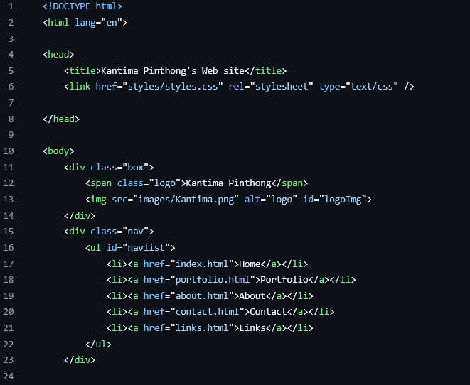

# http5110-Intro-WebDev
Class content from Intro to Web Devopment

***HTTP5110 - Intro to Web Devopment*** is class will help you use various tools as a web developer.
For example, learnรืเ how to use the 'Command Line Interface' and understand the core principles of website creation.

- [Linux Emulators](https://bellard.org/jslinux/vm.html?cpu=x86_64&url=alpine-x86_64.cfg&mem=256)
- [The MVP presentation](https://docs.google.com/presentation/d/1-6HIel753Y5MMn_0utepwFnDMJfSeDRYOrRWRNPAgMs/edit?slide=id.p#slide=id.p)

> Week 2 ``making simple website``

>!NOTE

`need to record timesheets to track work`